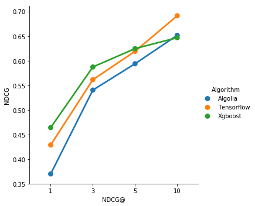

# Algolia Assignement

> This repository provide an end-to-end ML experiment and steps to analyze, build and test machine learning models. 

## Features
* 🔍 **Data Analysis and validation** of HN dataset, running on a local jupiter notebook
* 💫 **Algolia Search performance metrics** on local jupiter notebook
* 🏋️‍♀️ **Dataset preparation and features engineering**
* 🚀 **ML Experiments** for Learning-to-rank algorithms with **Tensorflow Ranking** and **Xgboost**
* 🐳 **Out of the box**, with dockerization

## The dataset
The dataset was provided by algolia. The data comes from [Hacker News Search](https://hn.algolia.com/).

## Dependencies
Docker:
* Engine version ≥ 17.05
* Compose version ≥ 1.13

## Setup the container

Clone the repo then build and run the container:
```
docker-compose build
docker-compose up -d
```

Then copy and paste the unzip data in the `/data` directory

## 1- 🔍 Analyzing and validating the data

> Jupyter notebook should be activated, go to [hnsearch_analysis](http://localhost:9999/notebooks/hnsearch_analysis.ipynb#)

This notebook is a preliminary analysis of Algolia dataset.

### Key findings
* There are some missing lines at the end of each file, I did not take them into account
* Looks like there are clicking bots (863 clicks in a few seconds for one query)
* Less than 10% of queries don't return any hit (63043/881052, 7%)

## 2- 💫 Performance metrics of Algolia Search

> Jupyter notebook should be activated, go to [algoliasearch_metrics](http://localhost:9999/notebooks/algoliasearch_metrics.ipynb#)

This notebook propose a serie of performance metrics to evaluate Algolia Search based on the given dataset.

### Key findings
* Mean Reciprocal Rank is **0.53**
* Mean Average Precision is **0.52**
* Average first click position is **4.55** (from previous notebook)

## 3- 👩‍🔬 Learning to Rank experiment

**Could we improve Algolia ranking with machine learning technics?**

> Algolia search engine returns a list of ranked documents, the optimisation of this ranked list is a Learning-to-rank problem. Learning-to-rank is a specific domain of machine learning, widely used by google for its search engine. We could try some experiments to improve ranking in returned documents.
> ⚠️ Due to time constrains, some shortcuts have been made, like not taking into account filters etc.. I also did not do a lot of algorithm tuning and took out-of-the-box algorithms..

### 1- Feature Engineering

Run the following commands (remove `--light` flag to compute the whole dataset):
```
docker exec -it algolia-assignement python build_dataset.py --light
```

The data is filtered on query with clicks and at least 2 hits (there is no ranking if only one hit is returned 😉). Some necessary HN data (post title, author, score etc) was queried with a simple script (`docker exec -it algolia-assignement python extract_hn_data.py`), this script took a few hours to run so the data is directly joined to the git repo.

The proposed features are:
* Keyword match in query
* Keyword match in query ponderated with TF-IDF
* Levenshtein distance
* HN score (with log1p transformation)

Some other features could be used (not implemented):
* Jaccard distance and other distance metrics
* Cosine Similarity Between aggregated Word2Vec of query and title
* Post age (query_timestamp - post_timestamp)

For Learning-to-rank algorithms, the output data must follow [the LIBSVM format](https://sourceforge.net/p/lemur/wiki/RankLib%20File%20Format). This format is well known in Learning-to-rank but not in other ML domains.

The result of this script is three files (`hn.train`, `hn.test` and `hn.vali`). The complete script takes fews hours to run, so I directly attached the data in the repo (not a good practice but covenient for this assignment).

### 2- Learning to Rank Algorithms

Two algorithms have beed tested:
* **🌳 [XgBoost](https://github.com/dmlc/xgboost)**: Xgboost is a famous and super performant tree boosting algorithm.
* **🛸 [Tensorflow Ranking](https://github.com/tensorflow/ranking)** *(freshly release in december 2018 👌)*: Tensorflow ranking is a tensorflow framework for learning-to-rank. The package is not available with `pip` so I cloned the repo and made some changes.

For XgBoost, run the command:
```
docker exec -it algolia-assignement python rank_xgboost.py
```

For Tensorflow Ranking, run the command:
```
docker exec -it algolia-assignement python rank_tensorflow.py
```

Tensorboard logs are saved, to see them:
```
docker exec -it algolia-assignement tensorboard --logdir=<ranker.model_dir output>
```
...and visit [localhost:6006](http://localhost:6006)

### 3- Evaluation metrics and results

* Little time was spent on algorithm tuning and results checking, so all results are to be cross-checked 🤞
* The most complicated part was actually building the training data frame in the LibSVM format (I did not know this format before)
* ML algorithm are performing well, the training is super fast even without GPUs
* Both Xgboost and Tensorflow Ranking increased significally the performance of Algolia Search (see graph below for nDCG), the average relevance position moved from **4.55** to **3.45** with tensorflow (more than one position gained 🎉!)
* Mean Reciprocal Rank is **0.53** for algolia alone, **0.46** for tensorflow and **0.56** for Xgboost


*For nDCG explanation see [this page](https://en.wikipedia.org/wiki/Discounted_cumulative_gain)*

**This simple experiment shows the posibilities for Algolia to improve its search relevance with machine learning technics 🧙‍♂️. This is only a short analysis and the work is amazingly huge to fully achieve it (in term of scalability, robusteness of algorithms, data processing, retraining etc..) but this is a super cool topic 😎!**

## Takeaways
* Algolia search is performing super well 👏 both in time performance and relevance
* Learning-to-rank is not well documented, this is a secret domain (google is not releasing a lot of stuff on that 🕵️‍♀️)
* Machine Learning could improve Algolia search relevance and click rate ↗️
* Algolia could also leverage other data to improve click rate, like users, ip address, history etc..
* I also found that some Algolia competitors are already building ML plugins for Learning-to-rank ([elasticsearch](https://elasticsearch-learning-to-rank.readthedocs.io/en/latest/index.html), [solr](https://lucene.apache.org/solr/guide/6_6/learning-to-rank.html))


